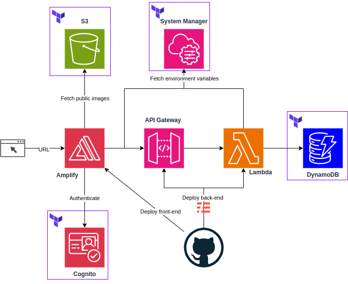

# Tasker.io

Tasker is a project management tool designed to facilitate team collaboration and task tracking. It provides a range of functionalities to manage projects, assign tasks, and monitor progress.

As I am primarily a backend/DevOps engineer, I focused on the backend, infrastructure, and CI/CD aspects of the project. The backend is built using a serverless architecture using AWS services such as Lambda, DynamoDB, and Cognito. The infrastructure is defined using Terraform, ensuring the application is scalable and easy to manage. The CI/CD pipeline is implemented using GitHub Actions, automating the testing and deployment process. The frontend is built using Next.js and Tailwind CSS hosted on Amplify.

The frontend was originally built by [Edward Roh](https://github.com/ed-roh). Special thanks for this amazing app! I lack frontend skills, so I had to borrow his work to make this project complete.

## Introduction

### Functionalities

- Sign up, log in, and sign out.
- Create projects and tasks.
- Assign tasks to team members.
- Update task status and track task progress.
- Light and dark mode support.

### Limitations

The application is still in the early stages of development and has several limitations. The following features are not yet implemented:
  
- Changing user avatars and settings.
- Changing task details.
- Changing team members.
- Uploading attachments.
- Adding comments to tasks.
- Deleting tasks and projects.

## Backend and Infrastructure

The backend is built using a serverless architecture, with **AWS Lambda** functions attached to **API Gateway** endpoints.

The infrastructure is defined using Terraform, which ensures the application is scalable and easy to manage. Key infrastructure components include:

- **S3**: Used for storing public images and other static assets.
- **DynamoDB**: Table definitions for storing different entities such as projects, users, teams, and tasks.
- **Cognito**: For user pool management and authentication.

**System Manager's Parameter Store** is used to store sensitive information and environment variables.



## CI/CD Pipelines

Tasker uses GitHub Actions for its CI/CD pipeline, which automates the testing and deployment process. There are 2 main workflows:

- **Amplify Deployment**: Deploys the frontend application to Amplify. This workflow is triggered on every push to the `tasker-client` directory of the repository.
- **Serverless Deployment**: Deploys the backend application to AWS. This workflow is triggered on every push to the `tasker-server` directory of the repository. Although the architecture is serverless, the directory is named `tasker-server` for consistency.

GitHub OIDC is used to authenticate the GitHub Actions workflows with AWS.

## Manual Deployment

Pre-requisites:

- **AWS credentials**: Ensure you have AWS credentials configured on your machine.
- **Terraform**.
- **Serverless Framework**.
- **Node.js** and **npm**.

Steps:

1. Set up the infrastructure using Terraform. Change the S3 bucket name in `terraform/s3.tf` to a unique name. Run the following commands:

```bash
npm run infra:deploy
```

2. Deploy the backend using the Serverless Framework. Run the following commands:

```bash
cd tasker-server
npm install
npm sls:deploy
```

(Optional) To populate the database with sample data, run the following command:

```bash
sls invoke local function -f populateSeedData 
```

3. Deploy the frontend using Amplify. It is recommended to use Amplify Console for this. Follow the instructions in the Amplify Console to deploy the frontend. Set the following environment variables in the Amplify Console to the values created in System Manager's Parameter Store:

- `NEXT_PUBLIC_API_BASE_URL`
- `NEXT_PUBLIC_COGNITO_USER_POOL_ID`
- `NEXT_PUBLIC_COGNITO_USER_POOL_CLIENT_ID`
- `NEXT_PUBLIC_S3_PUBLIC_IMAGE_URL`

The repo is a monorepo with the frontend in `tasker-client`, so set `AMPLIFY_MONOREPO_APP_ROOT` to `tasker-client`.
